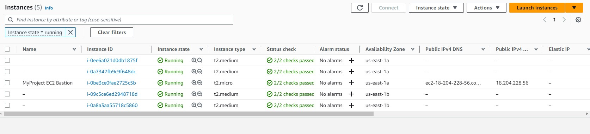
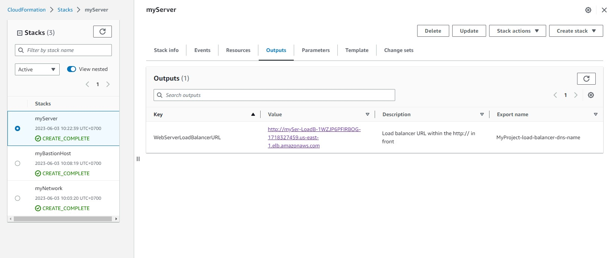

## Project Introduction
Deploy a dummy application (a sample JavaScript or HTML file) to the Apache Web Server running on an EC2 instance.
## Problem
### Scenario
Your company is creating an Instagram clone called Udagram.
Developers want to deploy a new application to the AWS infrastructure.
You have been tasked with provisioning the required infrastructure and deploying a dummy application, along with the necessary supporting software.
This needs to be automated so that the infrastructure can be discarded as soon as the testing team finishes their tests and gathers their results.
Optional - To add more challenge to the project, once the project is completed, you can try deploying sample website files located in a public S3 Bucket to the Apache Web Server running on an EC2 instance. Though, it is not the part of the project rubric.
## Project Requirements
### Server specs
- You'll need to create a Launch Configuration for your application servers in order to deploy four servers, two located in each of your private subnets. The launch configuration will be used by an auto-scaling group.
- You'll need two vCPUs and at least 4GB of RAM. The Operating System to be used is Ubuntu 18. So, choose an Instance size and Machine Image (AMI) that best fits this spec.
- Be sure to allocate at least 10GB of disk space so that you don't run into issues.
### Security Groups and Roles
- Since you will be downloading the application archive from an S3 Bucket, you'll need to create an IAM Role that allows your instances to use the S3 Service.
- Udagram communicates on the default HTTP Port: 80, so your servers will need this inbound port open since you will use it with the Load Balancer and the Load Balancer Health Check. As for outbound, the servers will need unrestricted internet access to be able to download and update their software.
- The load balancer should allow all public traffic (0.0.0.0/0) on port 80 inbound, which is the default HTTP port. Outbound, it will only be using port 80 to reach the internal servers.
- The application needs to be deployed into private subnets with a Load Balancer located in a public subnet.
- One of the output exports of the CloudFormation script should be the public URL of the LoadBalancer. Bonus points if you add http:// in front of the load balancer DNS Name in the output, for convenience.
## Solution
### Create 2 Key Pair in Console
- private-server-keypair.pem
- bastion-host-keypair.pem

### Create 
Stack Network 
```
aws cloudformation create-stack --stack-name myNetwork --template-body file://network.yml --parameters file://network-parameters.json --region us-east-1
```

<p align="center">
  
</p>
<p align="center">Output VPC</p>

Stack Server
```
aws cloudformation create-stack --stack-name myServer --template-body file://server.yml --parameters file://server-parameters.json  --capabilities "CAPABILITY_IAM" "CAPABILITY_NAMED_IAM" --region us-east-1
```
<p align="center">
  
</p>
<p align="center">Output Server</p>

Stack Bastion
```
aws cloudformation create-stack --stack-name myBastionHost --template-body file://bastion-host.yml --parameters file://bastion-host-parameters.json  --capabilities "CAPABILITY_IAM" "CAPABILITY_NAMED_IAM" --region us-east-1
```
<p align="center">
  
</p>
<p align="center">Output Bastion Host</p>

<p align="center">
  
</p>
<p align="center">Output CloudformationVPC</p>

<p align="center">
  
</p>

[Load balancer URL](http://myser-loadb-1wzjp6pfirbog-1718327459.us-east-1.elb.amazonaws.com/)

## Bastion to ssh to EC2 to debug
Get 2 IP Adress
- IP-bastion-host (Public IP): 50.17.89.64
- IP-private-server (Private IP): 10.0.2.117

Copy Key Pair to Bastion Host
```
scp -i bastion-host-keypair.pem private-server-keypair.pem ubuntu@IP-bastion-host:/home/ubuntu/private-server-keypair.pem
```
SSH login to the Bastion Host
```
ssh ubuntu@IP-bastion-host -i bastion-host-keypair.pem
```
Copy the private IP address of any private server
```
ls
## you must see the private-server-keypair.pem file
chmod 400 private-server-keypair.pem
ssh -i private-server-keypair.pem ubuntu@IP-private-server
```
<p align="center">
  
</p>

### Note:
Recall that the default user name for a Linux system is ec2-user and for an Ubuntu system is ubuntu.

### Delete Resources
Stack Bastion
```
aws cloudformation delete-stack --stack-name myBastionHost --region us-east-1
```
Stack Server
```
aws cloudformation delete-stack --stack-name myServer --region us-east-1
```
Stack Network
```
aws cloudformation delete-stack --stack-name myNetwork --region us-east-1
```