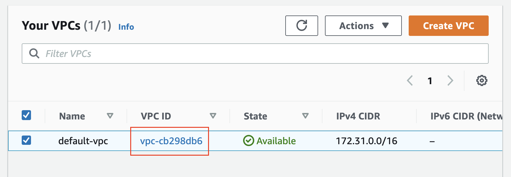
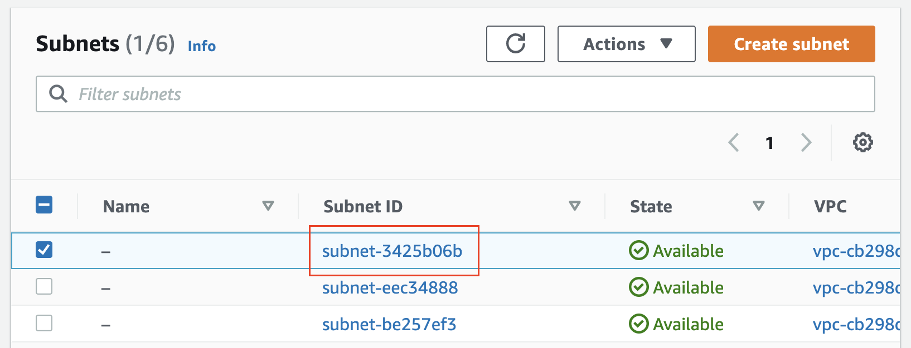
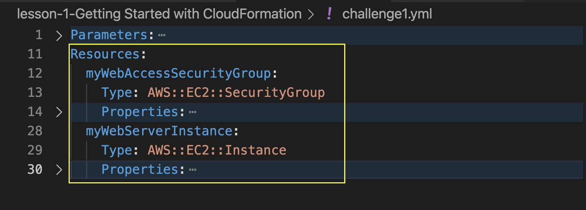
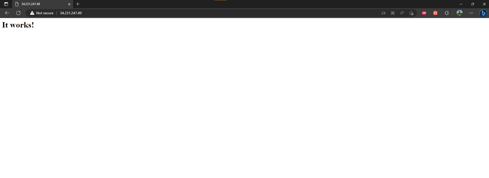

# Challenge 1 - Create an EC2 instance in a given VPC
## Prerequisites
### You should have a VPC available in your account. Note the ID of a particular VPC, to use in your new template.
<p align="center">
  
</p>

### You should have a public subnet available in the VPC selected above. Note down the subnet-ID.
<p align="center">
  
</p>

## ToDo
### Write a CloudFormation script that will create the following two Resources: AWS::EC2::SecurityGroup and AWS::EC2::Instance. See the snapshot below as a starter point.
<p align="center">
  
</p>

### 1. AWS::EC2::SecurityGroup
Creates a Security Group which only allows inbound access on TCP port 80 and also allows unrestricted outbound access. Refer to the documentation to check which properties you want to use.
### 2. AWS::EC2::Instance
In the same CloudFormation script: create a resource that deploys an EC2 Server and associate its network interface with the security group mentioned above. 
## Usage
### Create Stack SecurityGroup and EC2 Instance
```
aws cloudformation create-stack --stack-name myChallenge1 --template-body file://challenge1.yml  --parameters file://challenge1-parameters.json --region us-east-1
```
### Delete Stack SecurityGroup and EC2 Instance
```
aws cloudformation delete-stack --stack-name myChallenge1 --region us-east-1
```
## Output
To verify, you will use the public IP address of the newly launched EC2 instance, and paste it in a new browser window. You should see the Apache web server test page.
```
http://public-ip-address
```
<p align="center">
  
</p>
