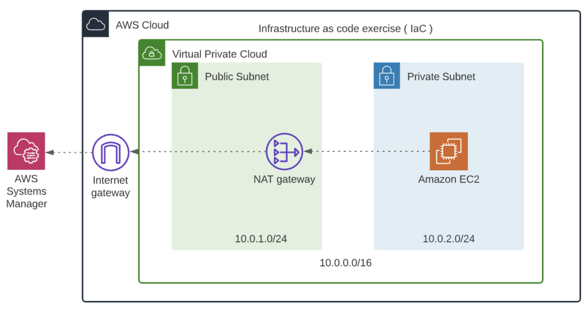

# Lesson 3
The servers.yml file defines various resources, such as security groups, an autoscaling group, launch configuration, target group, load balancer, and listener. Each type of resource has a different set of properties.
<p align="center">
  
</p>
<p align="center">
  
</p>
<p align="center">
  
</p>
<p align="center">
  Relationship between a Load balancer, Listener, Listener Rule, Target group, and an Autoscaling group. We will code them all
</p>

### Note: 
Create Stack Network in lesson 2 before!

### Create Stack Server
```
aws cloudformation create-stack --stack-name myServer --template-body file://server.yml --parameters file://server-parameters.json --region us-east-1
```
### Update Stack Server
```
aws cloudformation update-stack --stack-name myServer --template-body file://server.yml --parameters file://server-parameters.json --region us-east-1
```
### Delete Stack Server
```
aws cloudformation delete-stack --stack-name myServer --region us-east-1
```
<p align="center">
  
</p>

# Challenge 3
The ToDo in the current challenge is continuing to the Challenge 2 that you must have completed in the previous lesson.

## Prerequisites
You will need the VPC ID and Subnet ID from the previously created stack in Challenge 2.
<p align="center">
  
</p>

<p align="center">
  
</p>

## Overview
In this exercise, you have been tasked with deploying a Linux server in a private subnet, using the infrastructure that you created in a previous exercise. In the future, this machine will be a web server that sits behind a load balancer, so it never needs to be public, as long as the Load Balancer can reach it.

<p align="center">
  
</p>

If you look at the diagram it shows the EC2 Server connecting to AWS Systems Manager. This service will allow you to connect to this server and verify it’s working properly. This is because you cannot SSH into a server over the internet if it doesn’t have a public IP address. Actually, you could, if you set up a VPN inside your VPC, but that’s beyond the scope of this exercise.

In order to connect your instance to AWS Systems Manager, you will be using Amazon Linux 2 for your AMI, since it’s already installed and configured in there.

## ToDo
Use the infrastructure we created earlier to build and deploy the following:
- EC2 Instance: An Amazon Linux 2 EC2 server in the private subnet. Choose the right AMI ID as applicable to your region and thet3.micro instance-type.
- SecurityGroup: A security group for the server, that allows inbound port 80 access, for future use.
- IAM Role and InstanceProfile: The IAM Role to allow EC2 Session Manager to access our server. An InstanceProfile will allow passing the IAM role to our server.
- You will provide input parameters to this script, for future expansion and flexibility.
- Bonus/Optional: Instead of hard-coding the VPC and Subnet ID, use the import-export feature to cross reference the resources created in Challenge 2.

## Helpful hints
Mind the order of the Resources that you want to create. To help you get started, we have provided the snapshot of the starter template, see below:
<p align="center">
  
</p>

- Refer to the standard AWS Cloudformation EC2 resource and IAM resource documentation, as necessary.
- If you can't connect after a couple of minutes, it means there's something wrong with your networking setup. It could be either the Subnet Routing or NAT Gateway, and we recommend troubleshooting this manually in the web console before continuing.
- If you are running the script using the CLI and the cloudformation create-stack command, please remember to include the --capabilities "CAPABILITY_IAM" "CAPABILITY_NAMED_IAM" option (see the AWS CLI Documentation). This is because we are creating an IAM Role to provide permissions and we want to make the person executing create-stack aware of this fact.

## Usage
### Note: 
Create Stack Challenge2 in lesson 2 before!
### Create
```
aws cloudformation create-stack --stack-name myServerSecurity --template-body file://server-security.yml --capabilities "CAPABILITY_IAM" "CAPABILITY_NAMED_IAM" --region us-east-1
```
### Delete 
```
aws cloudformation delete-stack --stack-name myServerSecurity --region us-east-1
```