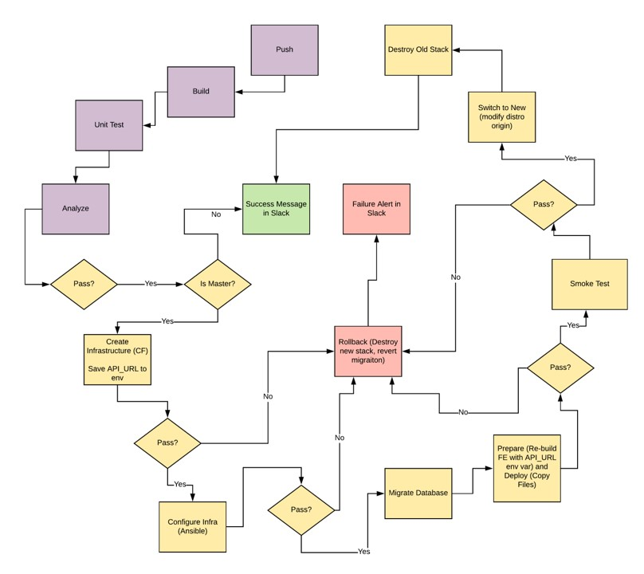
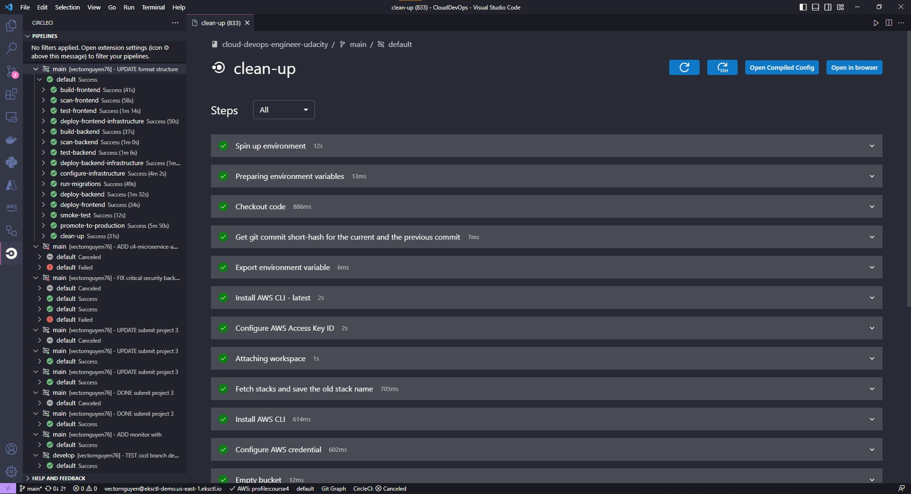
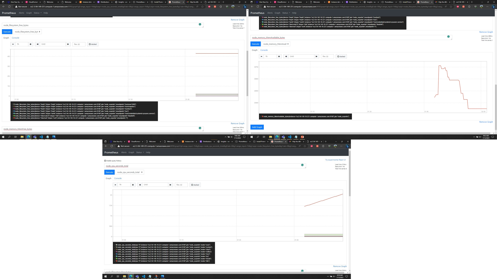
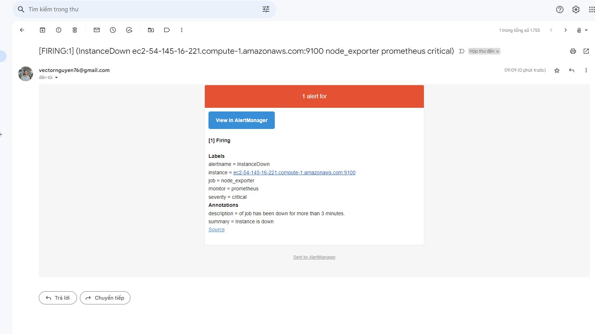
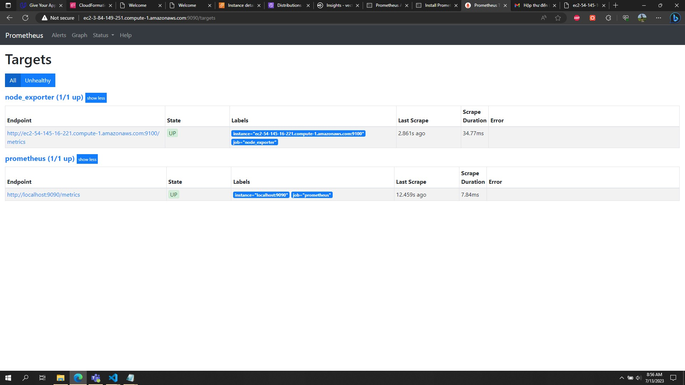
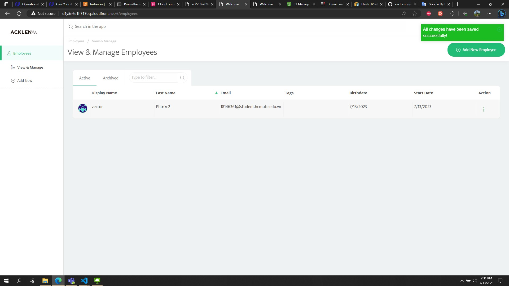

# Final Project: Application Auto-Deploy Superpowers
This project will prove mastery of the following learning objectives:

- Explain the fundamentals and benefits of CI/CD to achieve, build, and deploy automation for cloud-based software products.
- Utilize Deployment Strategies to design and build CI/CD pipelines that support Continuous Delivery processes.
- Utilize a configuration management tool to accomplish deployment to cloud-based servers.
- Surface critical server errors for diagnosis using centralized structured logging.

### Built With

- [Circle CI](www.circleci.com) - Cloud-based CI/CD service
- [Amazon AWS](https://aws.amazon.com/) - Cloud services
- [AWS CLI](https://aws.amazon.com/cli/) - Command-line tool for AWS
- [CloudFormation](https://aws.amazon.com/cloudformation/) - Infrastrcuture as code
- [Ansible](https://www.ansible.com/) - Configuration management tool
- [Prometheus](https://prometheus.io/) - Monitoring tool

### Instructions

* [Selling CI/CD](instructions/0-selling-cicd.md)
* [Getting Started](instructions/1-getting-started.md)
* [Deploying Working, Trustworthy Software](instructions/2-deploying-trustworthy-code.md)
* [Configuration Management](instructions/3-configuration-management.md)
* [Turn Errors into Sirens](instructions/4-turn-errors-into-sirens.md)

### Results
[Submission](submission)

<em>Done CI/CD Pipeline</em>

 

<em>Graphs of CPU, Disk and Memory utilization on systems being monitored</em>

 

<em>Alerts from a failing system that is being monitored</em>

 

<em>Running Prometheus server and Udapeople server</em>

 

<em>Front-end application in CloudFront</em>

### License

[License](LICENSE.md)
