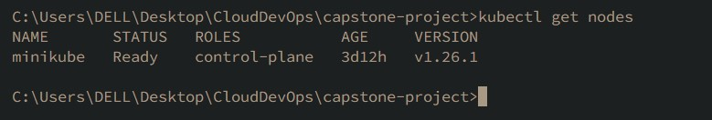
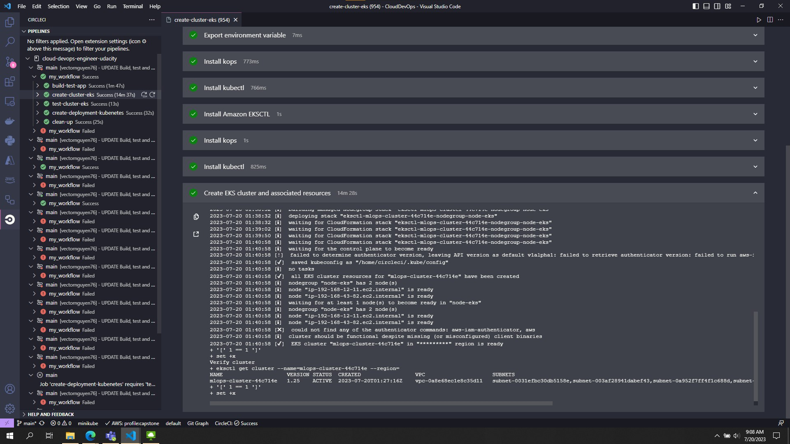
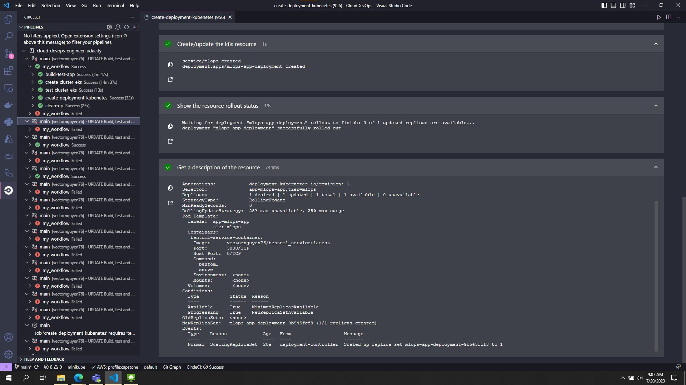

# Capstone Project:  CI/CD, Containerization and Kubernetes Deployment for Machine Learning
[](https://app.circleci.com/pipelines/github/vectornguyen76/cloud-devops-engineer-udacity)
## Overview
In this project, I will apply the skills and knowledge which were developed throughout the Cloud DevOps Nanodegree program. These include:
- Working in AWS
- Using Circle CI to implement Continuous Integration and Continuous Deployment
- Building pipelines
- Working with CloudFormation to deploy clusters
- Building Kubernetes clusters
- Building Docker containers in pipelines

### Local
1. Create environment and install packages:
    ```shell
    conda create -n mlops python=3.9
    ```
    ```shell
    conda activate mlops
    ```
    ```shell
    pip install -r requirements.txt
    ```
2. Convert to bentoml model
    ```shell
    python bentoml_model.py
    ```
3. Run 
    ```shell
    bentoml serve service.py:bentoml_service --reload
    ```
4. Test
    ```shell
    curl -X POST http://localhost:3000/classify1 -H "Content-Type: application/json" -d @test/prob_1/payload-1.json
    ```
    ```shell
    curl -X POST http://localhost:3000/classify2 -H "Content-Type: application/json" -d @test/prob_2/payload-1.json
    ```

### Managing Bentos
1. Export bentoml service
    ```
    bentoml export bentoml_service:latest ./bentoml_service
    ```
2. Import bentoml service
    ```
    bentoml import ./bentoml_service-oqlrrpbfhkrraaav.bento
    ```

### Development
1. Build BentoML service
    ```
    bentoml build
    ```
    Bento is the unit of deployment in BentoML, one of the most important artifacts to keep track of in your model deployment workflow. BentoML provides CLI commands and APIs for [managing Bentos](https://docs.bentoml.com/en/latest/concepts/bento.html#managing-bentos) and moving them around, see the Managing Bentos section to learn more.

2. Generate Docker Image
    A docker image can be automatically generated from a Bento for production deployment, via the bentoml containerize CLI command:
    ```
    bentoml containerize bentoml_service:latest
    ```
    This creates a docker image that includes the Bento, and has all its dependencies installed. The docker image tag will be same as the Bento tag by default:
    ```
    docker images
    ```
3. Run the docker image to start the BentoServer:
    ```
    docker run -it --rm -p 3000:3000 bentoml_service:oqlrrpbfhkrraaav serve
    ```

### Deploy to kubernetes in local
1. Start cluster use minikube and docker
    ```
    minikube start --driver=docker
    ```
    <p align="center">
    
    </p>
    <p align="center">Start cluster use minikube and docker</p>

2. Show node ready
    ```
    kubectl get nodes
    ```
    <p align="center">
    
    </p>
    <p align="center">Show nodes ready</p>

3. Deploy kubenetes template
    ```
    kubectl apply -f=master-deployment.yaml
    ```
    <p align="center">
    
    </p>
    <p align="center">Apply deployment template</p>

4. Show dashboard to check status
    ```
    minikube dashboard
    ```
    <p align="center">
    
    </p>
    <p align="center">
    
    </p>
    <p align="center">Show dashboard to check status</p>

5. Expose a deployment with a service
    ```
    minikube service mlops
    ```
    <p align="center">
    
    </p>
    <p align="center">
    
    </p>
    <p align="center">Test application successfully!</p>
### Deploy to kubenetes in cloud
1. Build and run cicd pipeline 
    <p align="center">
    
    </p>
    <p align="center">Build, test app with pylint - Containerize and push image to docker hub</p>

    <p align="center">
    
    </p>
    <p align="center">Create cluster in EKS CI/CD</p>

    <p align="center">
    
    </p>
    <p align="center">Create/update deployment template kubernetes in CI/CD</p>

2. Check resouces created
    <p align="center">
    
    </p>
    <p align="center">Check Cloudformation</p>

    <p align="center">
    
    </p>
    <p align="center">Check EKS</p>

    <p align="center">
    
    </p>
    <p align="center">Check EC2 Status</p>

    <p align="center">
    
    </p>
    <p align="center">Check connect to app via loadbalacer endpoint</p>

    <p align="center">
    
    </p>
    <p align="center">Test application successfully!</p>

3. Use Blue/Green Deployment
    <p align="center">
    
    </p>
    <p align="center">Use Blue/Green Deployment</p> 
    
## Reference 
- https://circleci.com/developer/orbs/orb/circleci/aws-eks
- https://circleci.com/developer/orbs/orb/circleci/kubernetes